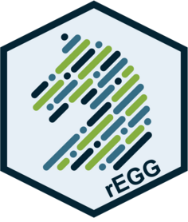

<!-- README.md is generated from README.Rmd. Please edit that file -->

```{r, include = FALSE}
knitr::opts_chunk$set(
  collapse = TRUE,
  comment = "#>",
  fig.path = "man/figures/README-",
  out.width = "100%"
)
```

# rEGG 

<!-- badges: start -->
<!-- badges: end -->

The goal of rEGG is to provide a user-friendly method to access the Equine Gut Group (EGG) database without having to process the raw data. 

## Installation

You can install the development version of rEGG from [GitHub](https://github.com/) with:

``` r
# install.packages("remotes")
remotes::install_github("zmcadams/rEGG")
```

## Downloading EGG metadata

To download the EGG metadata, run the following code: 

```r
getEGG(version = '1.1.1', data_type = 'metadata')
```

## Downloading EGG feature table

To download the EGG feature table, run the following code:

```r
getEGG(version = '1.1.1', data_type = 'table')
```

## Downloading EGG taxonomic assignments

To download the EGG taxonomic assignments, run the following code:

```r
getEGG(version = '1.1.1', data_type = 'taxonomy')
```

## Downloading EGG BioSample Accession numbers

To download the EGG BioSample Accession numbers, run the following code:

```r
getEGG(version = '1.1.1', data_type = 'biosample')
```


