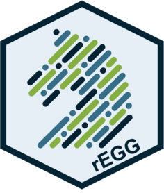

<!-- README.md is generated from README.Rmd. Please edit that file -->

# rEGG 

<!-- badges: start -->

<!-- badges: end -->

The goal of rEGG is to provide a user-friendly method to access the
Equine Gut Group (EGG) database without having to process the raw data.

## Installation

You can install the development version of rEGG from
[GitHub](https://github.com/) with:

``` r
# install.packages("remotes")
remotes::install_github("zmcadams/rEGG")
```

## EGG Metadata Categories

Brief explanations of the EGG metadata categories can be found by
running the command below. For more detailed explainations of the EGG
dataset, please refer to the EGG manuscript in *Animal Microbiome*
<https://doi.org/10.1186/s42523-025-00493-x>.

``` r
explainEGG()
```

## Downloading EGG metadata

To download the EGG metadata, run the following code:

``` r
metadata = getEGG(version = '1.1.1', data_type = 'metadata')
```

## Downloading EGG feature table

To download the EGG feature table, run the following code:

``` r
table = getEGG(version = '1.1.1', data_type = 'table')
```

**NOTE: Before downloading table, it is recommended to increase the
timeout limit for file downloads. Run the following code to increase to
10 minutes:**

``` r
options(timeout = 600)
```

## Downloading EGG taxonomic assignments

To download the EGG taxonomic assignments, run the following code:

``` r
taxonomy = getEGG(version = '1.1.1', data_type = 'taxonomy')
```

## Downloading EGG BioSample Accession numbers

To download the EGG BioSample Accession numbers, run the following code:

``` r
biosampleIDs = getEGG(version = '1.1.1', data_type = 'biosample')
```

## Subsetting the EGG Dataset

To subset the EGG dataset, filter the metadata to your desired samples
then run the command below. The subsetEGG() function will create a
directory containing CSV files for the filtered metadata, feature table,
and taxonomic assignments.

``` r
subsetEGG(  
  samples = filtered_metadata$sampleid, # Use list of sample ids
  metadata = metadata_object            # EGG metadata object from getEGG()
  table = table_object,                 # EGG table object from getEGG()
  taxonomy = taxonomy_object,           # EGG taxonomy object from getEGG()
  output_file = "output_directory"      # Name of output directory
)
```
